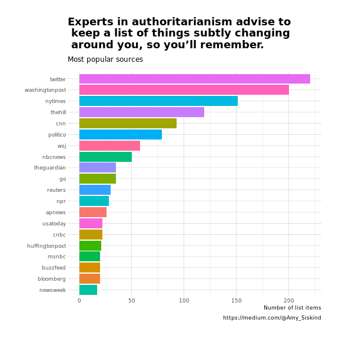

<!-- README.md is generated from README.Rmd. Please edit that file -->


# siskindr

Experts in authoritarianism advise to keep a list of things subtly changing around you, so you’ll remember.

R data package of Amy Siskind's Weekly Authoritarianism List https://medium.com/@Amy_Siskind

See http://rpubs.com/mhenderson/287527 for a demo app.

## Installation

You can install siskindr from github with:


```r
# install.packages("devtools")
devtools::install_github("MHenderson/siskindr")
```

## Example


```r
library(dplyr)
library(ggplot2)
library(hrbrthemes)
library(siskindr)

all_weeks %>%
  group_by(domain) %>%
  summarise(count = length(text)) %>%
  top_n(20) %>%
  ggplot(aes(x = reorder(domain, count), y = count, fill = domain)) +
    geom_bar_interactive(aes(tooltip = count), stat = "identity") +
    theme_ipsum_rc() +
    coord_flip() +
    labs(
      title = "Experts in authoritarianism advise to\n keep a list of things subtly changing\n around you, so you’ll remember.",
      subtitle = "Most popular sources",
      caption = "https://medium.com/@Amy_Siskind",
      y = "Number of list items",
      x = ""
    ) +
    guides(fill = FALSE) +
    theme(
      plot.title = element_text(size = 18),
      plot.subtitle = element_text(size = 12)
    )
```



